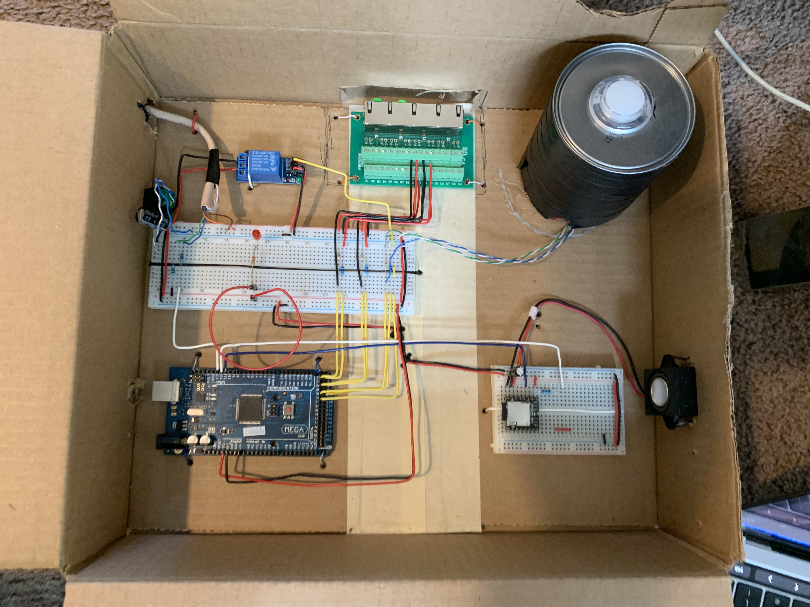
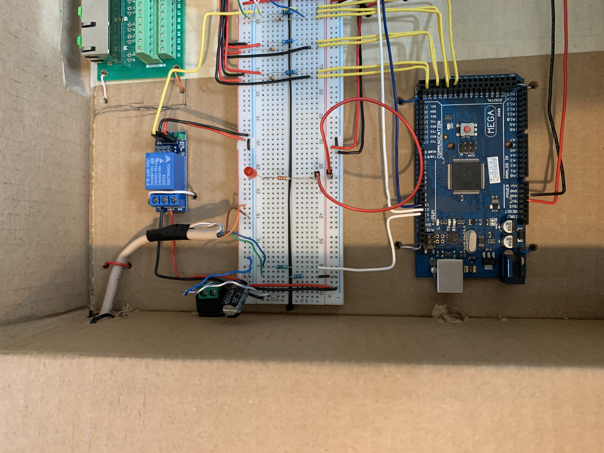
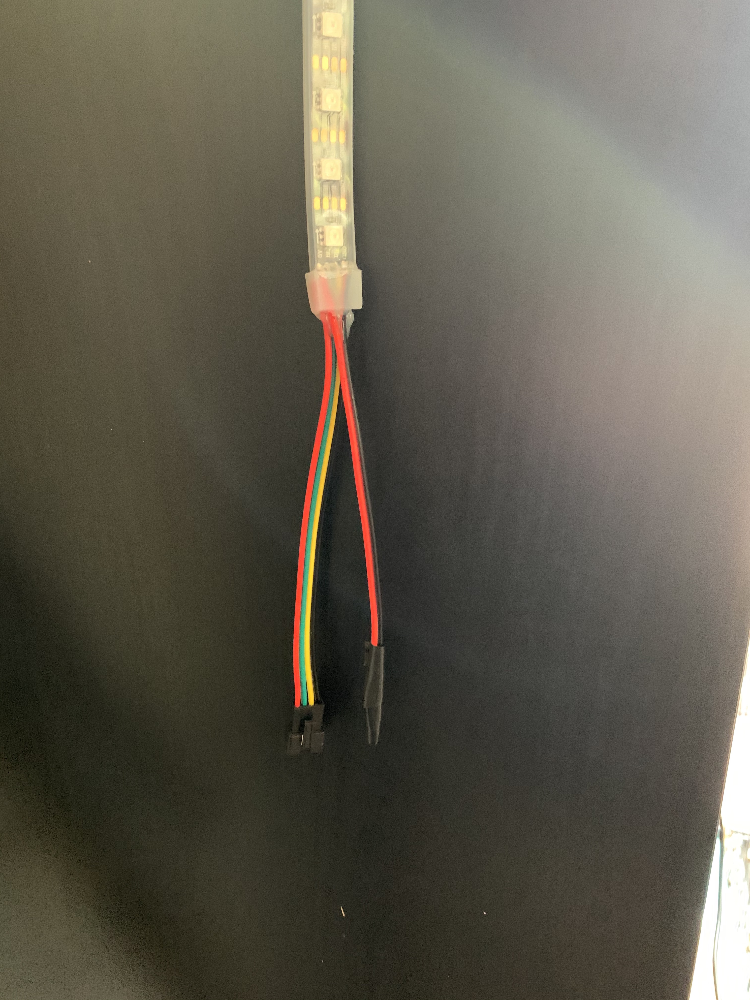
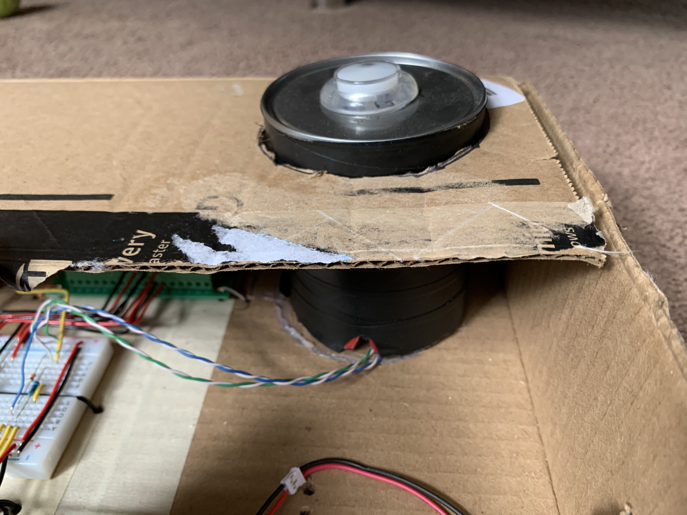
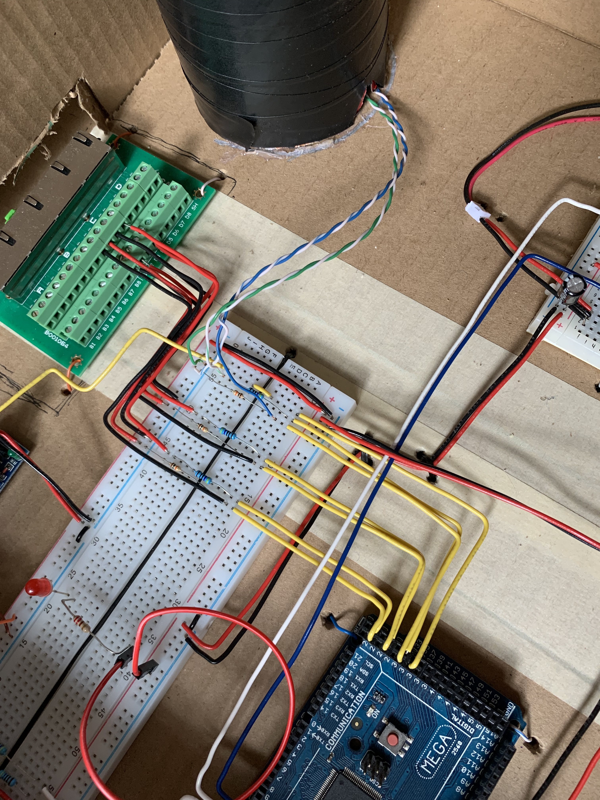
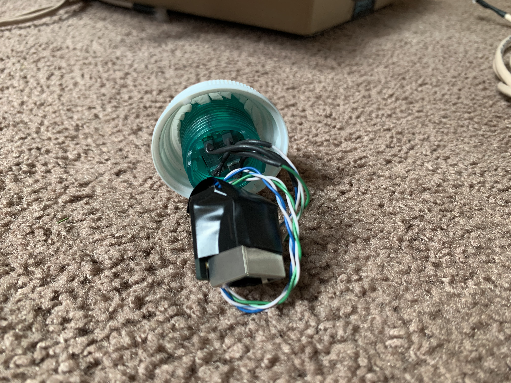
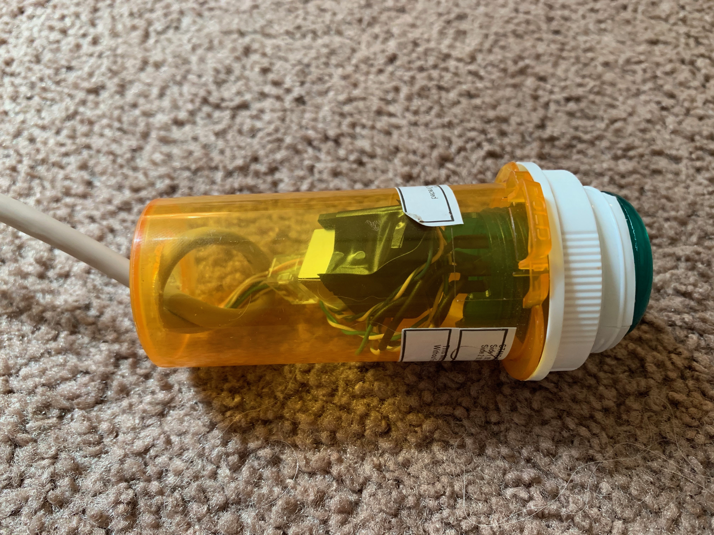
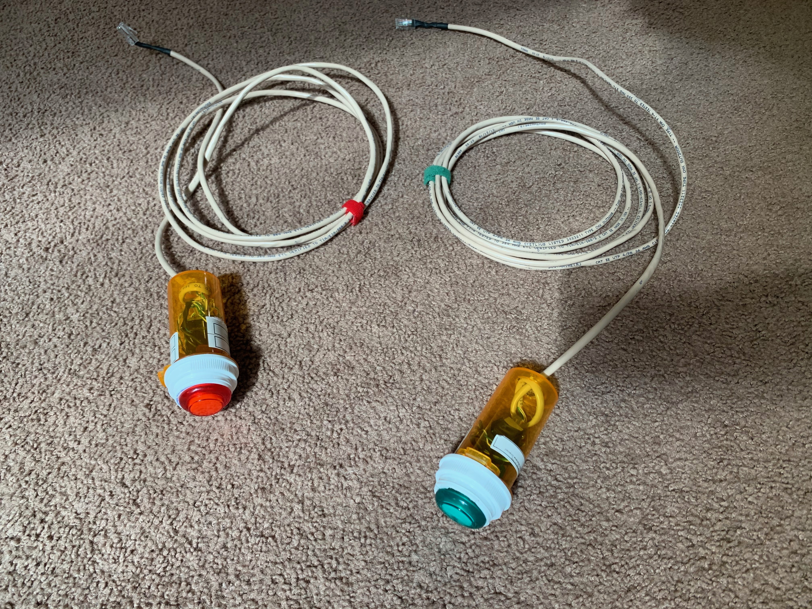
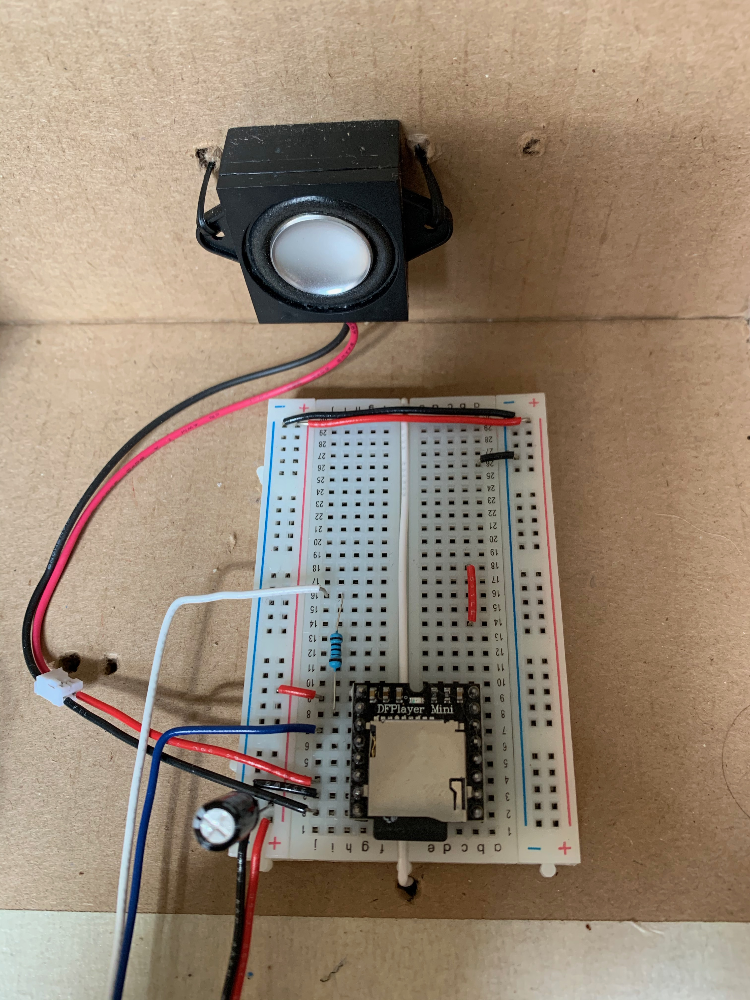

# Smash Dash 3000

_By: Summer_

[](https://www.youtube.com/watch?v=m0qOhI8Xyro "Smash Dash 3000")




This is a project about lights. I built an arduino based racing game involving smashing a button and racing to the end of an LED strip. There are added mechanics like gravity to make the game more exciting.

Shoutout to the inspiration for this project, [Open LED Race](https://create.arduino.cc/projecthub/gbarbarov/open-led-race-a0331a).

## Supplies

- Arduino Mega
- 5V Relay
- 5V 2.5A Power Supply
- WS2813 Led Strip 60 LED/5 Meter
- DF Player Mini
- RJ45 4-Port Breakout Board
- RJ45 Keystone (1)
- RJ45 Breakout (2)
- 1000 uF Capacitor
- 470 uF Capacitor
- 470 Ohm Resistor (5)
- 1000 Ohm Resistor
- 10k Ohm Resistor (3)
- Cardboard Box
- 3 Watt Speaker
- Pringles Can
- Empty Pill Bottle (2)
- 22 AWG Solid Wire
- Ethernet Cable
- Male RJ45 Connectors
- Breadboard
- Arcade Button (3)
- Micro SD

### Other things you'll need

- Micro SD Reader
- Wire Stripper
- RJ45 Crimper
- Soldering Iron
- Solder
- Shrinktube

## 1. Arduino and LED



### 1.1 Set up box

#### 1.1.1

Attach to your box: Arduino Mega, breadboard, relay, RJ45 plug, power supply plug

#### 1.1.2

Plug Arduino into breadboard (refer to wiring schematic).

#### 1.1.3

Plug relay into breadboard (refer to wiring schematic).

#### 1.1.4

RJ45 to breadboard, add resistors

Green = Back-up Data Line </br>
Blue = Data Line </br>
Orange = 5V </br>
Brown = Ground

Add a 470 Ohm resistor on both data line (refer to wiring schematic).

#### 1.1.5

Plug power supply into breadboard, add 1000 uF capacitor.

### 1.2 Set up LED strip

#### 1.2.1 Build LED extension wire

About 6-9 feet in length.

Solder wire connections.

Red (5V) = Orange </br>
Black (Ground) = Brown </br>
Yellow (Data) = Blue </br>
Green (Back-up Data) = Green

Use heat shrink.


#### 1.2.2 Tape LED wire leads



#### 1.2.3 Plug LED strip into RJ45 keystone.

### 1.3 Software: Turn on lights

See [`./code/step1-turnOnLights.ino`](./code/step1-turnOnLights.ino)

## Step 2: Start Button

### 2.1

Saw can half an inch inch taller than your box.



### 2.2

Cut a hole for your arcade button.

Solder lead wires to start button.


### 2.3

Connect start button lead wires to breadboard, and connect breadboard to Arduino.

Add 470 oHm resistor for LED.
Add 10k resistor for button.



### 2.4 Software: Moving Lights

See [`./code/step2-movingLights.ino`](./code/step2-movingLights.ino)

## Step 3: Controllers

### 3.1 Connect controller breakout board to arduino

#### 3.1.1 First controller

This is the configuration for the first player controller. All wires should be connected to breakout board port `D`.

Controller breakout port wire configuration:

- Wire 1: +5 volt return from leg 2 of switch
  - Connect to an available terminal strip on breadboard
  - Connect a 10k ohm resistor from this terminal strip to ground. This ground reference helps avoid false positive readings.
- Wire 2: +5 volt going to leg 1 of switch
  - Connect to +5 volt power rail on breadboard
- Wire 3: Ground for button LED
  - Connect to -5 volt power rail on breadboard
- Wire 4: +5 volt signal for button LED
  - Connect to an available terminal strip on breadboard
  - Connect arduino to the opposing terminal strip
  - Connect the two terminal strips with a 470 ohm resistor

Player 1 button = pin 26 </br>
Player 1 LED = pin 27

#### 3.1.2 Second controller

Follow the steps for the first controller, except this time using breakout port `C`.

Player 2 button = pin 22 </br>
Player 2 LED = pin 23

### 3.2 Make an ethernet cable

About 6-9 feet in length.


### 3.2

Drill a hole in the bottom of the pill container.


### 3.3 Controller Top Assembly



#### 3.3.1

Cut a hole in the lid of the pill container for the arcade button.

#### 3.3.2

Solder lead wires for your arcade button.

#### 3.3.3

Put your arcade button into the lid of the pill container.

#### 3.3.4

Attach the RJ45 Female breakout on the other side of the lid.

### 3.4 Controller Bottom Assembly


Insert the ethernet cord into the bottom of the pill container, then tie a loose knot immediately below the end of the ethernet cord.

### 3.5 Controller Final Assembly



Plug ethernet into RJ45 Female breakout. Be careful when you close container not to bend button pins.

### 3.6 Repeat for second controller



### 3.7 Software: Player Controls

See [`./code/step3-playerControls.ino`](./code/step3-playerControls.ino)

## Step 4: Audio


### 4.1 Plug DF Player into breadboard

Add capacitor and resistor.



### 4.2 Plug 3 watt speaker into breadboard

### 4.3 Download sounds on to Micro SD

>The folder name needs to be mp3, placed under the SD card root directory, and the mp3 file name needs to be 4 digits, for example, "0001.mp3", placed under the mp3 folder. If you want to name it in Both English and Chinese, you can add it after the number, for example, "0001hello.mp3" or "0001后来.mp3".

See [`./audio/](./audio).

### 4.4 Plug Micro SD into DF Player

### 4.5 Software: Audio

See [`./code/step4-audio.ino`](./code/step4-audio.ino)

## Step 5: Gravity

### 5.1 Measure


Hang your LED strip up on a wall or something. Choose a place that makes sense for gravity to begin, for example where the light strip begins traveling vertically.

Measure how far from the end of the LED strip this location is. Calculate the index of the LED at this position by using the measured length, the total length of the strip, and the distance between LEDs.

### 5.2 Software: Gravity time

See [`./code/step5-gravity.ino`](./code/step5-gravity.ino)

## Step 6: Final software

Add a winner to the game.


See [`./code/step6-final.ino`](./code/step6-final.ino)

## Step 7: Find a friend to compete with \o/

```txt
                        ██████        ██████████          ██████                        
                      ████████████████          ███████████████████                     
                    ████████████                        ████████████                    
                  ████████████                            ████████████                  
                  ██████████                                ██████████                  
                  ████████                                    ████████                  
                    ████        ██████            ██████        ████                    
                      ██      ████████            ████████      ██                      
                      ██    ██████  ██            ██  ██████    ██                      
                      ██    ██████████            ██████████    ██                      
                      ██    ██████████  ████████  ██████████    ██                      
                        ██  ████████    ████████    ████████  ██                        
                        ██    ████                    ████    ██                        
                          ██                                ██                          
                            ██                            ██                            
                              ████                    ████                              
                                ████████████████████████                                
                                ████████        ████████                                
                                ██  ████        ████  ██                                
                                ██                    ██                                
                                ██                    ██                                
                                  ████████████████████                                  
                                  ██████        ██████                                  
                                    ████        ████                                    
```

## Future Work

- [ ] Gravity contour
  - Right now gravity starts at a single point and remains on
  - Cooler to have multiple high and low portions, or have the strength of gravity change
- [ ] Make sure library imports are correct
  - Not sure if they are currently imported from project or global libraries directory
- [ ] 4 Players
  - Update code and wiring
- [ ] Use DFPlayer trigger pins
  - This will reduce use of software serial, increasing performance and audio responsiveness
  - Possible because there are two trigger ports and two sounds in our game lol
- [ ] Optimize parts list
  - Can probably make the parts list more simple and cheap
  - "Replace all female RJ45 with keystones"
- [ ] Use pullup input for controller
  - The current controller implementation uses normal input mode
  - https://www.arduino.cc/en/Tutorial/InputPullupSerial
  - This will allow the controller switch to share ground, reducing number of used wires back to the Arduino
- [ ] Dynamic player count
  - Code should use lists to dynamically handle any number of players
- [ ] Controller vibrators
  - Investigate how to connect vibrator motor without killing arduino or vibrator motor
  - Trial run with motor on breadboard
  - Install motor in pill bottle (Hot glue? Tape?)
- [ ] Taser mode
  - Investigate how to charge the taser transformer using arduino
  - Carefully plan installation: The high voltage released from the transformer will fry any of the existing components.
  - Install foil around a controller: half panels or quarter panels?
- [ ] Automatically detect connected players, and detect which position they are plugged in to
  - Use different resistors to identify controllers?

## Notes

### Light strip power delivery

With 24/4 cat 5e cable we see significant voltage drop at the end of the deployed LED strip. Adding a 3300uF capacitor at the top end does not improve the situation beyond a millisecond or so.

Voltage drop can be observed as color drift at the end of strip while entire strip is on. If the color should be white, led[0] is white, and led[300] is red.

Issue seems to be with the current available to the LED strip.

Amazon reviews for the 15A power supply we are using suggest its working load is closer to 3A.

Current required for LED strip:
- 300 LEDs
- Max bright 60ma per LED (found on random forum post)
- 300 * 60 = 18,000mA
- Power draw per foot:
  - LED per foot: 300 / 16.4= 18.3
  - Theoretical consumption: 18.3 * 60 = 1.1A

Observed:
- At constant 100 brightness
- Theoretical consumption: 300 * ((100 / 255) * 60) = 7.1A
- Power supply from amazon delivers a max of around 2.5A
- Desktop supply delivers a max of around 3.5A
- After a couple minutes at this, the base of the LED strip was starting to warm up

Seems like the LED strip cannot power itself at full brightness without starting to lose power to heat. This seems particularly bad, given the LED strip is soldered together sheets of flexible PCB.

FastLED has a power management API, which should limit the brightness of a `.show()` call based on the expected power consumption.
